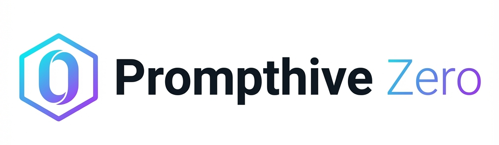

<div align="center">
  <a href="https://github.com/jovd83/prompthive-zero">
    
  </a>

  <p align="center">
    A ultra-lightweight, local-first prompt management tool designed for simplicity and privacy.
    <br />
    <br />
    <a href="https://github.com/jovd83/prompthive-zero/issues">Report Bug</a>
    ·
    <a href="https://github.com/jovd83/prompthive-zero/issues">Request Feature</a>
  </p>
</div>

**Prompthive Zero** is a ultra-lightweight, local-first prompt management tool designed for simplicity and privacy. It runs entirely in your browser as a **single HTML file** and stores all your data in a local `database.json` file on your computer.

This is a stripped-down version of the full featured [Prompthive](https://github.com/jovd83/prompthive), removing the need for servers, databases, or complex installations.

## ⚡ Prompthive Zero vs. Prompthive

Prompthive Zero is designed for users who want a portable, zero-setup solution. It has fewer features than the standard Prompthive but offers unique advantages for specific use cases.

| Feature | Prompthive Zero (This Repo) | [Prompthive (Standard)](https://github.com/jovd83/prompthive) |
| :--- | :--- | :--- |
| **Architecture** | Single HTML File | Full Web Application (Next.js, Database) |
| **Storage** | Local JSON File (`database.json`) | PostgreSQL / Cloud Database |
| **Installation** | Save a file & open in browser | Docker / Node.js Server Setup |
| **Privacy** | 100% Local Device | Self-Hosted or Cloud |
| **Images** | ❌ Text Only | ✅ Full Image & Attachment Support |
| **User Accounts** | ❌ Single User | ✅ Multi-User / Teams |

### ✅ Pros of Prompthive Zero
*   **Zero Setup**: Just download the `.html` file and double-click to run.
*   **Complete Privacy**: Your prompts never leave your hard drive.
*   **Portable**: Put the HTML file and your `database.json` on a USB stick and run it on any computer.
*   **Future Proof**: No dependencies to break, no servers to maintain. It will work as long as browsers exist.

### ❌ Cons
*   **Text Only**: No support for images or file attachments (unlike the main Prompthive).
*   **Browser Limits**: Relies on the File System Access API (Works best in Chrome, Edge, Brave; limited in Firefox/Safari).
*   **No Sync**: Data lives on one device (unless you sync the folder via Dropbox/Drive manually).
*   **Limited Features**: No user accounts, sharing, or advanced team features.

### Choose for the fully featured Prompthive if you want:
*   **Image & Attachment Support**: Upload and manage prompts with rich media.
*   **Cloud Sync**: Access your library from any device, anywhere.
*   **Multi-User & Teams**: Collaborate with others, share collections, and manage permissions.
*   **Advanced AI Features**: Direct integration with LLM APIs for testing prompts within the app.

---

## 🚀 Getting Started

1.  Download the latest `index.html` from the **Releases** page (or build it yourself).
2.  Create a folder on your computer (e.g., `My Prompts`) to store your library.
3.  Open `index.html` in a Chromium-based browser (Chrome, Edge).
4.  Click **"Open Project Folder"** and select the folder you created.
5.  Start creating prompts!

## 🛠️ Features

*   **Local Storage**: Uses the File System Access API to persist data to `database.json`.
*   **Prompt Management**: Create, edit, and delete prompts with titles, descriptions, and tags.
*   **Collections**: Organize prompts into nested collections.
*   **Variables**: Automatically detects `{{variable}}` syntax in prompts and provides a form to fill them.
*   **Favorites**: Quickly mark and access your most-used prompts.
*   **Search & Filter**: Real-time search and tag filtering.
*   **Import/Export**: Backup your entire library to JSON.
*   **Dark Mode**: Sleek, modern interface.

## 💻 Local Development

If you want to modify the code or build it yourself:

1.  **Clone the repository**:
    ```bash
    git clone https://github.com/jovd83/prompthive-zero.git
    cd prompthive-zero
    ```

2.  **Install dependencies**:
    ```bash
    npm install
    ```

3.  **Run development server**:
    ```bash
    npm run dev
    ```

4.  **Build single file**:
    ```bash
    npm run build
    # The output file will be at dist/index.html
    ```

## 📄 License

MIT License. Feel free to use and modify as you wish.
